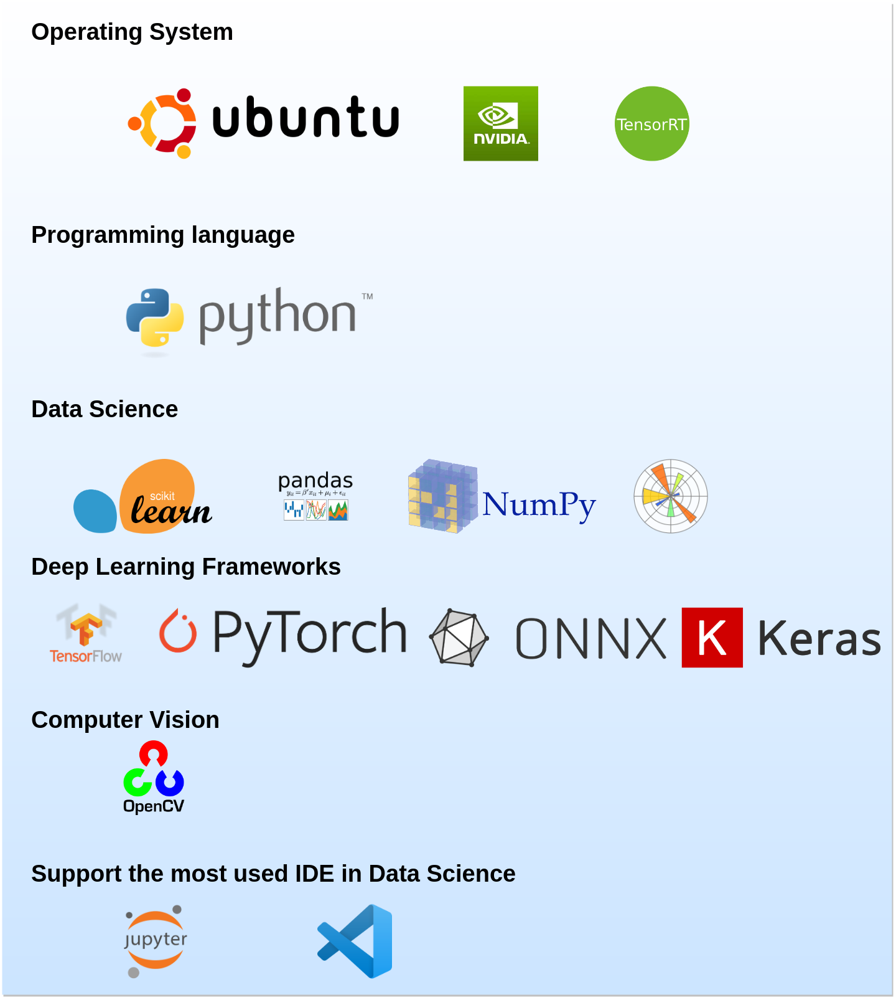
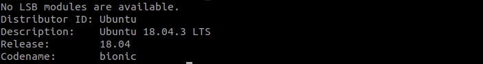
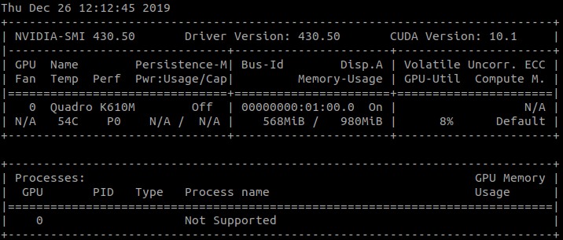
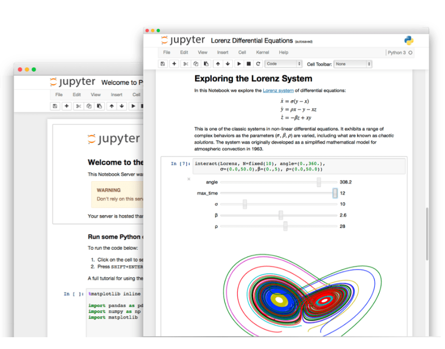
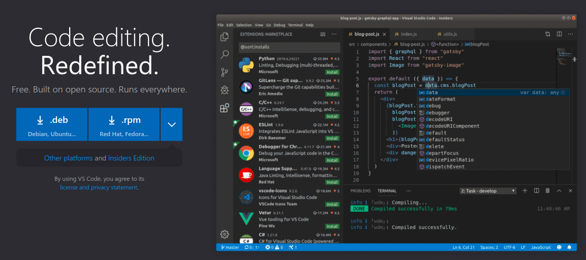
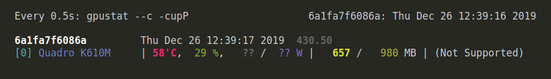
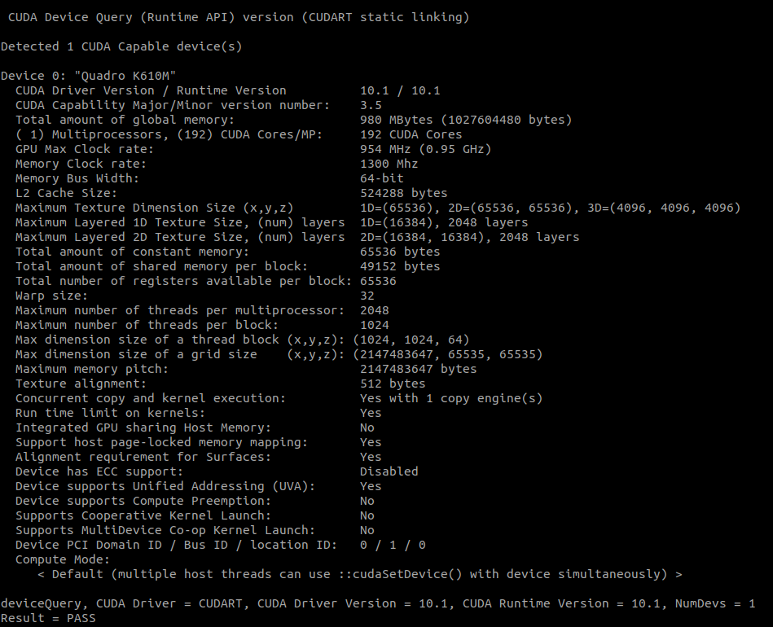

# AI-lab: The Ideal Tool for Data Scientists to Develop and Export Machine Learning Models




- [AI-lab: The Ideal Tool for Data Scientists to Develop and Export Machine Learning Models](#ai-lab-the-ideal-tool-for-data-scientists-to-develop-and-export-machine-learning-models)
  - [1.1. Description](#11-description)
  - [1.2. Pre-requisites](#12-pre-requisites)
  - [1.3. USAGE](#13-usage)
  - [1.4. Launch an IDE and Start Developing](#14-launch-an-ide-and-start-developing)
    - [1.4.1. Jupyter notebook](#141-jupyter-notebook)
    - [1.4.2. VS Code](#142-vs-code)
  - [1.5. Display the Memory Usage of the GPU](#15-display-the-memory-usage-of-the-gpu)
  - [Do you have any suggestions ?](#do-you-have-any-suggestions-)


## 1.1. Description

This project is for creating a development environment for data scientist. It helps the users developing machine learning models in a simple way,
- Focus on code not on the tool.
- Saving time that could be wasted during installing.
- Prevent broking the OS by installing incompatible packages.

I hand-crafted `AI-lab` (on top of [NVIDIA Container](https://ngc.nvidia.com/catalog/containers/nvidia:tensorrt)) and took advantage of [Docker](https://www.docker.com/products/docker-desktop) capabilities to have a reproducible and portable development environment.


`AI-lab` allows developing artificial intelligence (AI) based application in Python using the most common artificial intelligence frameworks. `AI-lab` is meant to be used to building, training, validating, testing your deep learning models, for instance is a a good tool to do transfer learning.

**It includes**

- Ubuntu 18.04
- NVIDIA CUDA 10.1
- NVIDIA cuDNN 7.6.0
- OpenCV 4.1.0
- Python 3.6
- Most common AI framework:
  - TensorFlow, PyTorch, ONNX, Keras, ONNX-TensorRT, Jupyter-lab, VS Code integration with remote development, Numpy, Matplotlib, Scikit-learn, Scipy, Pandas,  TensorRT and more.

## 1.2. Installation

Some pre-requisites need to be installed on the OS before using `AI-lab`

* You must have an operating system with AMD64 architecture. Check that in the terminal
  ```
  dpkg --print-architecture
  ```
  For example I use Ubuntu 18.04.3 LST. You can check your system with this command
  ```
  lsb_release -a
  ```
  

*  [NVIDIA drivers](https://www.nvidia.com/Download/index.aspx) and [CUDA toolkit](https://developer.nvidia.com/cuda-downloads).
    ```
    nvidia-smi
    ```
    On my laptop machine I have NVIDIA Driver version 430.50 and CUDA version 10.01.
    
* Docker-ce must be installed on your OS. To install or reinstall docker-ce, please follow the original Docker-ce [installation guide](https://docs.docker.com/install/linux/docker-ce/ubuntu/), including the [post-installation](https://docs.docker.com/install/linux/linux-postinstall/) steps for Linux.


## 1.3. Usage

**First pull AI-lab from Docker Hub registery** : [AI-lab](https://hub.docker.com/repository/docker/aminehy/ai-lab)
```bash
docker pull aminehy/ai-lab
```

The latest image have around 9.97GB, so make sure you have enough space (and high speed internet :simple_smile:).

**Then run AI-lab and start your development**

``` bash
xhost +
docker run -it --rm
--runtime=nvidia
-v $(pwd):/workspace \
-w /workspace \
-v /tmp/.X11-unix:/tmp/.X11-unix \
-e DISPLAY=$DISPLAY \
-p 8888:8888 -p 6006:6006 aminehy/ai-lab:latest
```

**Install UFF converter  `convert-to-uff` (if you need it)**

Once you run AI-lab, move to `/opt/tensorrt/python` folder and install `convert-to-uff` using the following commands:

```bash
cd /opt/tensorrt/python
dpkg -i *-tf_*.deb
UFF_PATH="$(python -c 'import uff; print(uff.__path__[0])')"
chmod +x ${UFF_PATH}/bin/convert_to_uff.py
ln -sf ${UFF_PATH}/bin/convert_to_uff.py /usr/local/bin/convert-to-uff
```

## 1.4. Launch an IDE and Start Developing your Application

### 1.4.1. Jupyter notebook

If `AI-lab` runs correctly on your machine then `Jupyter notebook` should run automatically. If this is not the case, launch it from the terminal with this command

```bash
jupyter notebook --allow-root --port=8888 --ip=0.0.0.0 --no-browser
```


### 1.4.2. VS Code

[VS Code](https://code.visualstudio.com/) is an IDE that offers the possibility to develop from inside docker container (thus, inside `AI-lab`), through the extension [Remote Development](https://marketplace.visualstudio.com/items?itemName=ms-vscode-remote.vscode-remote-extensionpack). More details [here](https://code.visualstudio.com/docs/remote/containers).

I have added two configuration folders `.devcontainer` and `.vscode` to the folder `AI-LAB_in_vscode`. They are necessary to be able to use VS Code with `AI-lab`. These two folders are hidden and must live in the directory of your application so that VS Code automatically detect the `AI-lab` configuration. Therefore, you need to copy them inside your application folder.

To get these folders, first clone this repository and move to it

```bash
git clone https://github.com/amineHY/AI-lab.git
cd /AI-lab
```

Copy the two folders to your application folder, for instance `/path_to_folder_application`

``` bash
sudo cp -R AI-lab/AI-LAB_in_vscode/.* /path_to_folder_application
```

Finally, move to your application folder

```bash
cd /path_to_folder_application
```

and launch VS Code

```
code .
```


## 1.5. Display the Memory Usage of the GPU

Depending on your development, you might want to watch the memory consumption of your GPU. You can do that thanks to `gpustat`

```bash
watch -n0.5 -c gpustat --c -cupP
```
Output for my OS:


## Display information about you GPU with `deviceQuery`

in the terminal, run `deviceQuery` script (provided in this repository) to get more information about your GPU configuration
```
./deviceQuery
```
Output for my OS:



## Do you have any suggestions, anything to report or want to improve AI-lab?

- Please create an issue on GitHub.
- Get in touch with me on [LinkedIn](https://www.linkedin.com/in/aminehy/).