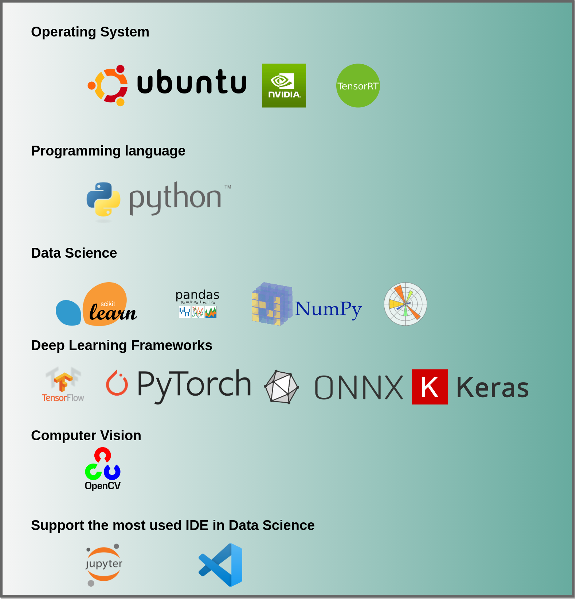

# 1. AI-lab: The Ideal Tool for Data Scientists to Develop and Export Machine Learning Models




<!-- TOC -->autoauto- [1. AI-lab: The Ideal Tool for Data Scientists to Develop and Export Machine Learning Models](#1-ai-lab-the-ideal-tool-for-data-scientists-to-develop-and-export-machine-learning-models)auto    - [1.1. Description](#11-description)auto    - [1.2. Pre-requisites](#12-pre-requisites)auto    - [1.3. USAGE](#13-usage)auto    - [1.4. Launch an IDE and Start Developing](#14-launch-an-ide-and-start-developing)auto        - [1.4.1. Jupyter notebook](#141-jupyter-notebook)auto        - [1.4.2. VS Code](#142-vs-code)autoauto<!-- /TOC -->
## 1.1. Description

This project is reserved for creating a new development environment using docker for developing AI models in data science, in particular, computer vision.

I hand-crafted AI-lab (on top of [NVIDIA Container](https://ngc.nvidia.com/catalog/containers/nvidia:tensorrt)) and take advantage of docker capability to have a reproducible and portable development environment. AI-lab allows you developing your artificial intelligence based application in Python using the most used artificial intelligence frameworks.

AI-lab is meant to be used to building, training, validating, testing your deep learning models, for instance is a a good tool to do transfer learning.

**It includes**

- Ubuntu 18.04
- NVIDIA CUDA 10.1
- NVIDIA cuDNN 7.6.0
- OpenCV 4.1.0
- Python 3.6
- Most used AI framework:
  - TensorRT
  - TensorFlow
  - PyTorch
  - ONNX
  - Keras
  - ONNX-TensorRT
  - Jupyter-lab
  - VS Code integration with remote development
  - numpy
  - matplotlib
  - scikit-learn
  - scipy
  - pandas
  - and more

## 1.2. Pre-requisites

* An operating system with AMD64 architecture (`dpkg --print-architecture`), e,g, 64-bit Linux OS (check with `lsb_release -a`)

*  NVIDIA drivers and [CUDA toolkit](https://developer.nvidia.com/cuda-downloads): (check with `nvidia-smi`)

* Docker-ce: Install or reinstall docker-ce, please follow the original docker-ce [installation guide](https://docs.docker.com/install/linux/docker-ce/ubuntu/), including the [post-installation](https://docs.docker.com/install/linux/linux-postinstall/) steps for Linux


## 1.3. USAGE

To install AI-lab you must have `docker-ce` installed on your machine to be able to use the pre-configured development environment. To do that, simply follow the steps to install [docker for Ubuntu](https://docs.docker.com/install/linux/docker-ce/ubuntu/), or select the suitable version depending on your OS.

**Pull AI-lab from Docker Hub**

```bash
docker pull aminehy/ai-lab
```

**Run the AI-lab and start your development**

``` bash
xhost +
docker run -it --rm
--runtime=nvidia
-v $(pwd):/workspace \
-w /workspace \
-v /tmp/.X11-unix:/tmp/.X11-unix \
-e DISPLAY=$DISPLAY \
-p 8888:8888 -p 6006:6006 aminehy/ai-lab:latest
```

**Install UFF converter : `convert-to-uff`**

Once you run AI-lab, move to `/opt/tensorrt/python` folder and install `convert-to-uff` using the following commands:

```bash
cd /opt/tensorrt/python
dpkg -i *-tf_*.deb
UFF_PATH="$(python -c 'import uff; print(uff.__path__[0])')"
chmod +x ${UFF_PATH}/bin/convert_to_uff.py
ln -sf ${UFF_PATH}/bin/convert_to_uff.py /usr/local/bin/convert-to-uff
```

## 1.4. Launch an IDE and Start Developing

### 1.4.1. Jupyter notebook

If AI-lab runs correctly on your machine then `Jupyter notebook` should run automatically. If this is not the case, launch it from the terminal with this command

```bash
jupyter notebook --allow-root --port=8888 --ip=0.0.0.0 --no-browser
```

### 1.4.2. VS Code


[VS Code](https://code.visualstudio.com/) offers the possibility to develop from inside docker container (thus, inside AI-lab), through the extension [Remote Development](https://marketplace.visualstudio.com/items?itemName=ms-vscode-remote.vscode-remote-extensionpack). Read more in details [here](https://code.visualstudio.com/docs/remote/containers).

Two configuration folders `.devcontainer` and `.vscode` (inside `AI-LAB_in_vscode`) are necessary to be able to use VS Code inside AI-lab. These two folders are hidden and must live in the directory of your application so that VS Code automatically detect AI-lab configuration. Therefore, you need to copy them inside your application folder.

To get these folders, first clone this repository and move to it

```bash
git clone https://github.com/amineHY/AI-lab.git
cd /AI-lab
```

Copy the two folders to your application folder, for instance `/path_to_folder_application`

``` bash
sudo cp -R AI-lab/AI-LAB_in_vscode/.* /path_to_folder_application
```

Finally, move to your application folder and launch VS Code

```bash
cd /path_to_folder_application
code .
 ```

## 1.5. Display the Memory Usage of the GPU

Depending on you developing, you might want to watch the memory consumption of your GPU. You can do that thanks to `gpustat`.

```bash
watch -n0.5 -c gpustat --c -cupP
```

## Do you have any suggestions ?

Please create an issue or contact me and let me know on [LinkedIn](https://www.linkedin.com/in/aminehy/).